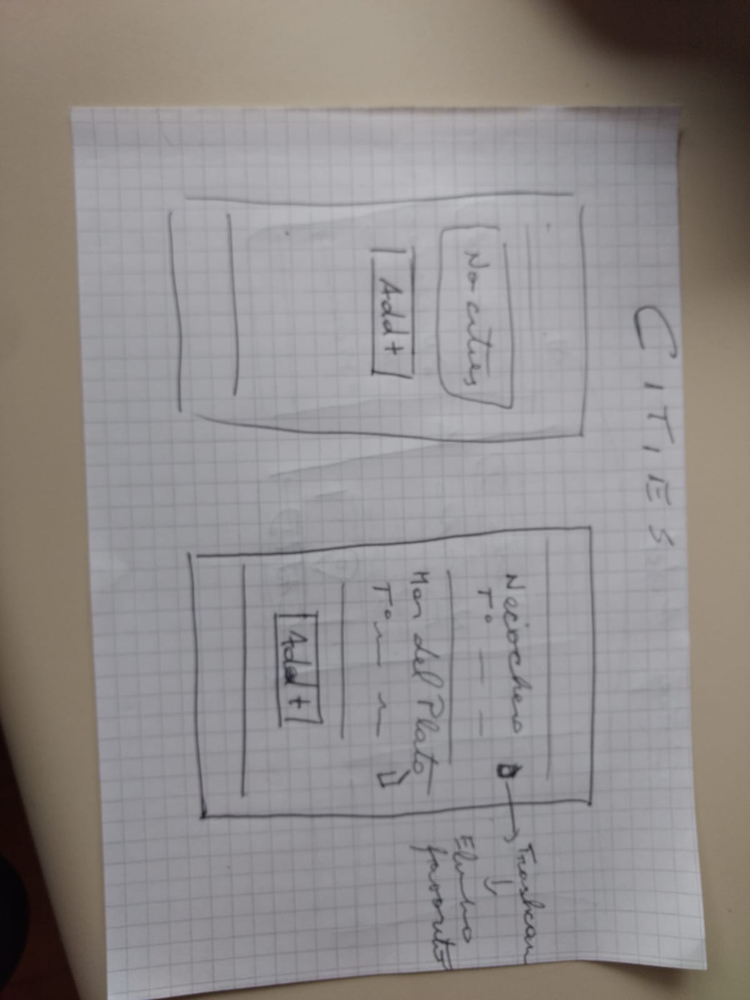
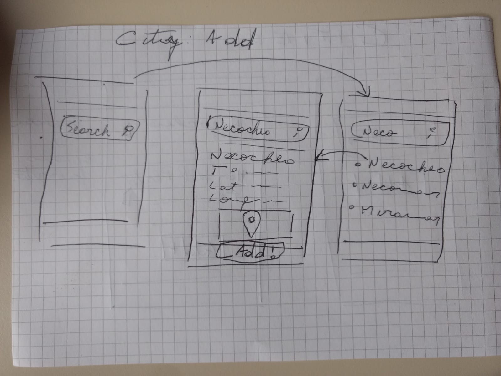

# Nubes Heladas

## Instrucciones de Instalacion

### Instalacion del ambiente

- Segui la documentacion oficial de [Expo](https://docs.expo.dev/get-started/installation/) para la instalacion del mismo.
- Segui la esta simple guia para instalar tu propio [emulador de Android Studio](https://docs.expo.dev/workflow/android-studio-emulator/)

### Inicilizando el proyecto

- Abri tu emulador de Android o conecta tu dispositivo fisico
- Desde tu CLI de preferencia y ubicado en el directorio del proyecto, inicia el mismo con el comando
  ```bash
  yarn android
  ```
- Espera a que todo cargue y listo!

## Paperprototyping





## Canvas persona

### Camila

- Camila es una joven emprendedora que quiere vender helados en distintos lugares y necesita estar informada acerca del clima para poder manejar su negocio de manera eficiente.
- Camila sufre de **cartofobia**, por lo que no quiere que la aplicacion que vaya a usar contenga ningun tipo de mapa.
- Camila ama el minimalismo.
